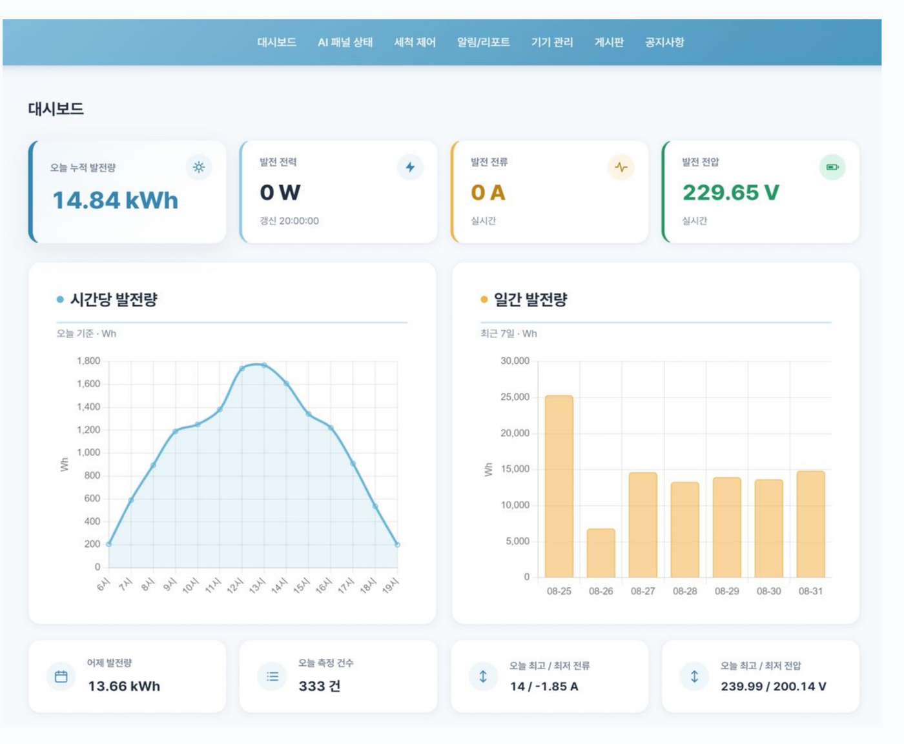
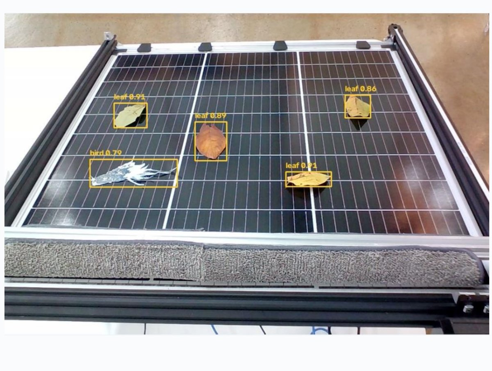
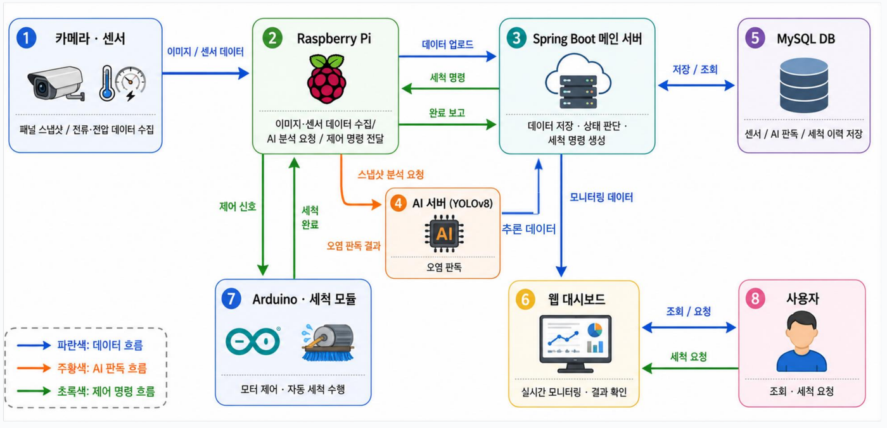
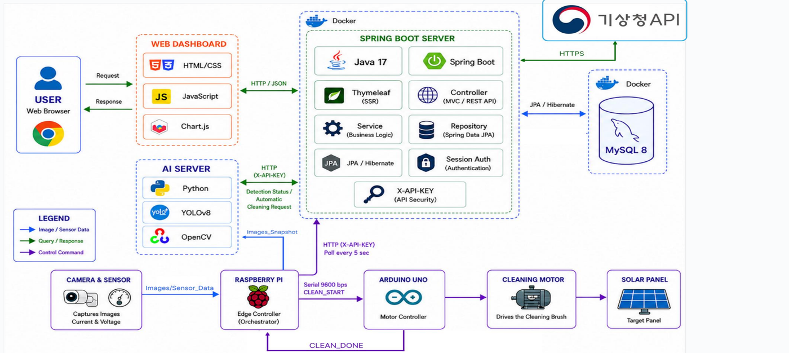

# Solar Guardian

AI가 지키는 우리집 태양광 발전 효율

태양광 발전소를 웹에서 관리하는 프로젝트입니다. 발전량을 실시간으로 보여주고, 카메라로 패널을 촬영해서 AI로 오염 여부를 판단한 다음, 오염이 감지되면 자동으로 세척 모터를 돌립니다.

태양광 패널은 먼지나 새똥, 낙엽이 조금만 쌓여도 발전 효율이 눈에 띄게 떨어지는데, 매번 사람이 올라가서 육안으로 확인하기는 번거롭습니다. 한국에너지공단 자료를 보면 가정용 태양광 누적 보급이 2023년 기준 51만 가구를 넘었는데, 정작 오염 여부를 스스로 진단하고 대응하는 관리 체계는 대부분 대규모 발전소·상업용 설비에나 갖춰져 있고 가정용은 사각지대에 가깝습니다. 그래서 카메라가 패널을 계속 지켜보다가 오염이 확인되면 세척까지 자동으로 이어지도록 만들었습니다.

로그인하면 뜨는 메인 대시보드는 이렇게 생겼습니다 — 오늘 발전량과 실시간 전류·전압, 시간대별 발전량 추이를 한눈에 볼 수 있습니다.



## 기능

- 전류/전압 실시간 모니터링, 시간대별 발전량 그래프
- AI(YOLOv8)로 패널의 먼지·새·낙엽 오염을 실시간으로 탐지하고, 일정 시간 이상 계속 감지되면 자동으로 세척 요청
- 대시보드에서 수동으로 세척 명령을 내릴 수도 있음
- 전류/전압이 정상 범위를 벗어나면 알림 발생 (같은 알림이 반복되지 않게 쿨다운 적용)
- 기상청 API로 날씨 예보 표시
- 여러 태양광 설비(기기/패널 어레이)를 회원별로 등록해서 관리
- 공지사항, 자유게시판 (댓글/첨부파일)

패널을 실시간으로 판독한 결과는 이렇게 박스로 표시됩니다.



대시보드 상단 메뉴는 대시보드 · AI 패널 상태 · 세척 제어 · 알림/리포트 · 기기 관리 · 게시판 · 공지사항으로 구성돼 있습니다.

## 구조

Spring Boot 서버가 중심이고, 라즈베리파이가 센서값을 주기적으로 서버에 올립니다. 세척이 필요하면 라즈베리파이가 시리얼 통신으로 아두이노에 명령을 보내서 스텝모터를 구동합니다.

AI 추론은 GPU가 있는 데스크탑에서 따로 돌립니다. 라즈베리파이의 웹캠 스트림을 받아서 YOLOv8로 분석하고, 오염이 감지되면 서버의 세척 요청 API를 직접 호출합니다. 추론 서버는 영상을 내보내는 스레드와 실제 추론을 도는 스레드를 분리해뒀는데, GPU 부하가 걸리거나 세척이 진행 중이라 추론이 잠깐 멈춰도 영상 자체는 끊김 없이 재생되도록 하기 위해서입니다. 표시 스레드는 최신 원본 프레임 위에 가장 최근 추론 결과만 얹어서 내보내고, 세척이 트리거되는 순간엔 그 결과를 비워서 더 이상 유효하지 않은 탐지 박스가 화면에 남지 않게 합니다.



오염 판정은 프레임 한 장이 아니라 같은 클래스(먼지/새/낙엽)가 일정 프레임 이상 연속으로 감지될 때만 확정합니다. 그림자나 반사광 같은 순간적인 노이즈에 실제 세척 모터가 움직이는 걸 막기 위해서입니다. 세척 완료 직후나 같은 유형의 센서 알림이 반복될 때도 일정 시간은 다시 트리거되지 않도록 쿨다운을 뒀습니다.

인증은 두 가지가 공존합니다. 대시보드 화면은 로그인 세션으로 인증하고, 라즈베리파이·GPU 서버처럼 브라우저가 아닌 곳에서 오는 요청은 `X-API-KEY` 헤더로 인증합니다. API를 통째로 나누는 대신 같은 컨트롤러 안에서 요청 종류에 따라 인증 방식만 분기하는 구조입니다.

회원 탈퇴나 게시글·댓글 삭제도 실제로 row를 지우지 않고 `del_yn` 플래그로 비활성화하는 소프트 삭제 방식을 씁니다. 센서 데이터나 세척 이력처럼 계속 쌓이기만 하는 테이블은 이 대상에서 빼고 필요한 타임스탬프만 뒀습니다.

기상청 API 키처럼 개인적으로 발급받은 값은 코드에 직접 넣지 않고 환경변수(`.env`, `application-local.properties`)로 분리해서 관리합니다.

## 기술 스택

Java 17, Spring Boot 3.5, Spring MVC + Thymeleaf, Spring Data JPA, MySQL 8

AI 쪽은 Python + YOLOv8(Ultralytics) + OpenCV. 하드웨어는 라즈베리파이(Python)와 아두이노(C++)로 연동했고, 배포는 Docker를 씁니다.



## API

대시보드 화면이 쓰는 API(`/api/sensor`, `/api/panel`, `/api/cleaning`, `/api/alert`)는 로그인 세션으로 인증합니다. 라즈베리파이와 GPU 서버가 호출하는 API는 세션이 없어서 `X-API-KEY` 헤더로 따로 인증하는데, 센서값 업로드, 패널 스냅샷/오염탐지 결과 보고, 세척 명령 폴링·완료 보고가 여기 해당합니다.

## 실행

MySQL이 떠 있어야 하고, `.env.example`을 복사해서 `.env`를 만든 뒤 필요한 값(기상청 API 키 등)을 채워주세요.

```bash
cp .env.example .env
./gradlew bootRun
```

Docker로 띄우려면:

```bash
docker compose up -d
```

DB 스키마는 자동 생성되지 않으므로 `sql/` 폴더의 DDL을 직접 실행해야 합니다.

배포용 compose 파일은 두 개로 나눠뒀습니다. `docker-compose.yml`은 로컬에서 소스를 직접 빌드하고, GPU 서버용 `docker-compose.gpu.yml`은 소스 없이 Docker Hub에 미리 push해둔 이미지만 pull해서 띄웁니다. GPU 서버엔 AI 추론이 따로 돌고 있어서 굳이 매번 빌드 환경까지 옮길 필요가 없어 이렇게 나눴습니다.

## 폴더 구조

```
src/main/java/com/kopo/solar/
  controller/  화면(Controller) + API(RestController)
  service/
  repository/
  entity/
  dto/
  util/

raspberrypi/   센서 전송, 스냅샷 업로드, 세척 제어 (Python)
arduino/       세척 모터 제어 (C++)
ai/            YOLOv8 학습 및 추론 서버 (Python)
sql/           테이블 생성 스크립트
```
